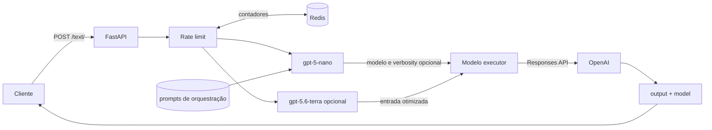
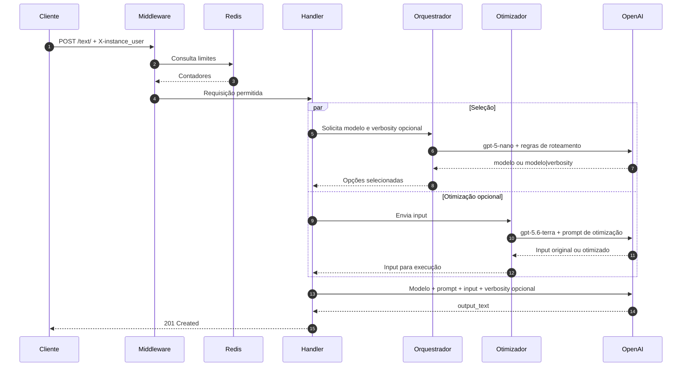

<p align="center">
  
</p>

<h1 align="center">AiAgentSelector</h1>

<p align="center">
  <strong>Roteamento inteligente de modelos para aplicações que usam a OpenAI Responses API.</strong>
</p>

<p align="center">
  <a href="https://www.python.org/">
    
  </a>
  <a href="https://fastapi.tiangolo.com/">
    
  </a>
  <a href="https://developers.openai.com/api/">
    
  </a>
</p>

<p align="center">
  <a href="https://redis.io/">
    
  </a>
  <a href="https://www.docker.com/">
    
  </a>
  <a href="https://docs.pydantic.dev/">
    
  </a>
  <a href="LICENSE">
    
  </a>
</p>

<p align="center">
  
  
  
</p>

<p align="center">
  <a href="#como-funciona">Como funciona</a> ·
  <a href="#arquitetura">Arquitetura</a> ·
  <a href="#como-executar">Como executar</a> ·
  <a href="#api">API</a> ·
  <a href="#contribuindo">Contribuindo</a>
</p>

---

## Sobre o projeto

Usar o modelo mais poderoso para toda solicitação funciona, mas nem sempre faz sentido. Tarefas simples acabam custando mais e levando mais tempo do que deveriam; tarefas difíceis, por outro lado, precisam de capacidade suficiente para não comprometer o resultado.

O **AiAgentSelector** fica entre o cliente e a API da OpenAI para resolver esse problema. Ele analisa cada entrada, escolhe um modelo compatível com a dificuldade da tarefa e só então executa a solicitação.

O projeto é **open source** e distribuído sob a [MIT License](LICENSE). Você pode usar, modificar e distribuir o código, desde que preserve o aviso de copyright e o texto da licença.

### O que o projeto entrega

- uma única API para acessar diferentes modelos;
- seleção automática baseada no conteúdo de cada requisição;
- seleção opcional do nível de verbosidade da resposta final;
- otimização opcional da entrada antes da execução;
- separação entre a lógica de roteamento e a execução da tarefa;
- identificação do modelo escolhido em todas as respostas de sucesso;
- controle de tráfego compartilhado por meio do Redis;
- configuração simples por variáveis de ambiente;
- execução reproduzível com Docker Compose.

### Onde ele pode ser usado

O serviço pode funcionar como gateway para chatbots, assistentes internos, ferramentas de desenvolvimento, automações, APIs de geração de conteúdo e produtos que atendem solicitações com níveis de complexidade muito diferentes. O consumidor não precisa conhecer todos os modelos disponíveis: ele envia a tarefa e recebe a resposta juntamente com o modelo utilizado.

## Como funciona

Uma requisição completa passa por quatro etapas principais.

### 1. Entrada e identificação

O cliente envia um `POST` para `/text/`. O corpo contém a tarefa, as instruções de resposta e os parâmetros de geração. O cabeçalho `X-instance_user` identifica o consumidor da chamada para fins de controle de tráfego.

### 2. Controle de requisições

Antes de encaminhar o payload, o middleware consulta o Redis. Existem dois escopos de controle: um contador compartilhado por toda a aplicação e outro associado ao identificador recebido no cabeçalho.

### 3. Escolha do modelo e da verbosidade

O serviço de orquestração analisa o campo `input` com o `gpt-5-nano`. Quando `verbosity` é `false`, ele usa `orquestration.md` e retorna somente o identificador do modelo. Quando `verbosity` é `true`, usa `orquestration_withverbosity.md` e retorna o modelo e o nível de detalhamento no formato `modelo|verbosity`.

Os níveis permitidos são `low`, `medium` e `high`. A escolha da verbosidade é independente da escolha do modelo: uma tarefa complexa pode pedir uma resposta curta, enquanto uma tarefa simples pode exigir uma explicação extensa.

### 4. Otimização opcional

Quando o objeto `optimizate` é enviado e seu limite permite o processamento, o `gpt-5.6-terra` analisa a entrada em paralelo com o orquestrador. O texto otimizado substitui o `input` somente na chamada ao modelo executor. Se a otimização não trouxer ganho, o agente pode devolver a entrada original.

### 5. Execução e resposta

O modelo selecionado recebe o `prompt` como instrução e a entrada original ou otimizada como conteúdo. Quando a seleção automática de verbosidade está habilitada, o nível escolhido é enviado à Responses API por meio de `text.verbosity`. O texto consolidado é devolvido em JSON, acompanhado pelo ID do modelo e pelo tipo de conteúdo.

Sem otimização, cada chamada bem-sucedida faz **duas inferências**: uma curta para roteamento e outra para execução. Com otimização ativa, são feitas **três inferências**: roteamento e otimização em paralelo, seguidos pela execução.



## Seleção de modelos

As regras de decisão ficam em `src/repository/prompt/orquestration.md` e `src/repository/prompt/orquestration_withverbosity.md`. O objetivo não é escolher o maior modelo disponível, e sim o modelo mais econômico que ainda consiga resolver a tarefa com segurança.

| Modelo | Quando é escolhido |
|---|---|
| `gpt-5.6-luna` | Tarefas curtas, previsíveis e de baixa complexidade. |
| `gpt-5.6-terra` | Trabalho de complexidade moderada que pede equilíbrio entre custo e capacidade. |
| `gpt-5.6-sol` | Problemas ambíguos, profundos ou com várias restrições relacionadas. |
| `gpt-5.3-codex` | Implementação, alteração e depuração de código. |

O roteador deve responder somente com o ID exato de um desses modelos. Os modelos também precisam estar disponíveis para a conta e para o projeto associados à chave da API.

### Critérios considerados

O prompt de orquestração orienta a escolha a partir de fatores como:

- profundidade de raciocínio necessária;
- clareza ou ambiguidade da solicitação;
- quantidade de restrições que precisam ser atendidas ao mesmo tempo;
- conhecimento técnico exigido;
- natureza conceitual ou prática da tarefa;
- necessidade de escrever, modificar ou depurar código;
- relação entre custo, velocidade e capacidade.

O tamanho do texto não determina sozinho a complexidade. Uma entrada curta pode exigir raciocínio profundo, enquanto um texto longo pode representar uma transformação simples e previsível.

### Papéis dos prompts

O projeto separa as instruções internas de roteamento, verbosidade e otimização das instruções fornecidas pelo cliente:

| Origem | Destino | Função |
|---|---|---|
| `orquestration.md` | Modelo roteador | Define como analisar a tarefa e retornar somente o ID do modelo. |
| `orquestration_withverbosity.md` | Modelo roteador | Define como retornar o modelo e a verbosidade no formato `modelo|verbosity`. |
| `optimizate.md` | Modelo otimizador | Decide se a entrada deve ser aprimorada e produz o texto que será enviado ao executor. |
| Campo `prompt` da requisição | Modelo executor | Define o estilo, o formato e as regras da resposta final. |

Essa divisão impede que as regras internas de seleção precisem ser repetidas por cada cliente da API.

## Arquitetura

O AiAgentSelector é um monólito modular. A API roda em um único serviço FastAPI, com Redis e OpenAI como dependências externas. Os módulos compartilham o mesmo processo, mas cada grupo possui uma responsabilidade definida.

| Camada | Arquivo ou diretório | Responsabilidade |
|---|---|---|
| Inicialização | `src/controller/init/main.py` | Cria a instância FastAPI, registra a política CORS, adiciona o middleware global e inclui os routers. Também exporta o objeto `app` consumido pelo Uvicorn. |
| HTTP | `src/handles/text.py` | Expõe `/text/`, coordena roteamento e otimização, aplica a verbosidade escolhida e monta o contrato JSON. |
| Validação | `src/schema/text.py` | Declara os campos aceitos pela rota e delega a validação de tipos ao Pydantic. |
| Orquestração | `src/service/orquestration_agent.py` | Seleciona o prompt adequado e solicita ao `gpt-5-nano` o modelo, com verbosidade opcional. |
| Otimização | `src/service/optimizate_agent.py` | Usa o `gpt-5.6-terra` para aprimorar a entrada quando essa etapa está habilitada. |
| OpenAI | `src/utils/openai.py` | Cria o cliente, chama a Responses API, combina `max_output_tokens` e `text.verbosity`, trata parâmetros específicos dos modelos e extrai `output_text`. |
| Cache | `src/repository/redis/` | Cria a conexão com o Redis e oferece operações de leitura, incremento e expiração para os contadores. |
| Prompt | `src/repository/prompt/` | Localiza, lê e disponibiliza as regras completas de roteamento durante a inicialização. |
| Configuração | `src/config/settings.py` | Procura o `.env`, carrega as variáveis e garante a presença das configurações obrigatórias. |
| Logs | `src/logs/log.py` | Define formato, nível e destinos dos eventos gerados pelos outros módulos. |
| Infraestrutura | `src/controller/` | Mantém o Dockerfile, o Compose, a lista fixada de dependências e o comando de inicialização. |

### Serviços e comunicação

O `compose.yml` inicia dois serviços:

| Serviço | Responsabilidade | Comunicação |
|---|---|---|
| `ai_agent` | Executa FastAPI com Uvicorn e publica a porta `8000`. | Recebe HTTP do cliente, acessa `redis:6379` e faz chamadas HTTPS para a OpenAI. |
| `redis` | Armazena os contadores temporários usados pelo middleware. | Fica disponível para a API pela rede interna do Compose. |

O código-fonte de `src/` é copiado para `/app/src` durante o build. O ponto de entrada do contêiner é `src.controller.init.main:app`.

### Fluxo interno



### Estado da aplicação

A API não mantém sessão local. O estado compartilhado se resume aos contadores com expiração no Redis:

| Chave | Escopo |
|---|---|
| `global_rate_limit` | Todas as requisições. |
| `rate_limit:{user}` | Requisições associadas ao valor de `X-instance_user`. |

As chaves usam expiração padrão de 60 segundos. Dessa forma, o Redis concentra o estado temporário e a API não precisa manter sessões em memória entre uma requisição e outra.

### Logs

Os logs são gravados em `src/logs/app.log` e também enviados para a saída padrão do processo. O formato reúne data, nível, nome do logger e mensagem:

```text
2026-08-26 19:05:09,989 | INFO | src.logs.log | Executando agente orquestrador...
```

Entre os eventos registrados estão o início das rotas, consultas ao Redis, escolha de modelos, chamadas externas, avisos de compatibilidade e exceções.

## Estrutura do projeto

```text
AiAgentSelector/
├── README.md
├── LICENSE
├── src/
│   ├── config/
│   │   └── settings.py
│   ├── controller/
│   │   ├── compose.yml
│   │   ├── depends/
│   │   │   ├── dockerfile
│   │   │   └── requirements.txt
│   │   └── init/
│   │       └── main.py
│   ├── handles/
│   │   └── text.py
│   ├── logs/
│   │   └── log.py
│   ├── midlleware/
│   │   └── base.py
│   ├── repository/
│   │   ├── module.py
│   │   ├── prompt/
│   │   │   ├── file.py
│   │   │   ├── optimizate.md
│   │   │   ├── orquestration.md
│   │   │   └── orquestration_withverbosity.md
│   │   └── redis/
│   │       ├── connect.py
│   │       └── control.py
│   ├── schema/
│   │   └── text.py
│   ├── service/
│   │   ├── optimizate_agent.py
│   │   └── orquestration_agent.py
│   └── utils/
│       └── openai.py
└── tests/
    ├── api.py
    ├── config.py
    ├── logs.py
    ├── repository.py
    ├── service.py
    └── utils.py
```

## Tecnologias

| Tecnologia | Versão declarada | Papel no projeto |
|---|---:|---|
| Python | `3.14.7` | Runtime da aplicação. |
| FastAPI | `0.141.1` | API HTTP e geração do schema OpenAPI. |
| Uvicorn | `0.52.4` | Servidor ASGI. |
| Pydantic | `2.13.4` | Validação dos dados de entrada. |
| OpenAI SDK | `3.3.1` | Acesso à Responses API. |
| redis-py | `8.1.0` | Comunicação com o Redis. |
| Docker Compose | — | Execução conjunta da API e do Redis. |

## Como executar

### Requisitos

- Docker com o comando `docker compose`;
- uma chave da API da OpenAI;
- acesso aos modelos configurados no prompt de roteamento.

Não é necessário instalar Python, Redis ou as bibliotecas do projeto no sistema quando a execução é feita pelo Compose.

### Configuração

Crie `src/config/.env` com:

```dotenv
api_key=sk-substitua-pela-sua-chave
rate_limit=10
global_rate_limit=100
origin=http://localhost:3000
```

| Variável | Obrigatória | Uso |
|---|:---:|---|
| `api_key` | Sim | Autentica as chamadas à OpenAI. |
| `rate_limit` | Sim | Limite planejado por identificador de usuário. |
| `global_rate_limit` | Sim | Limite planejado para toda a aplicação. |
| `origin` | Não | Origem aceita pelo CORS; o padrão atual é `*`. |

Não envie o `.env` para o repositório. Se uma chave for exposta, revogue-a e gere outra.

O carregamento da configuração acontece na inicialização. A aplicação procura primeiro `src/config/.env`; no ambiente Docker, as mesmas variáveis também são injetadas pelo campo `env_file` do Compose.

### Docker Compose

Na raiz do projeto, execute:

```bash
docker compose -f src/controller/compose.yml up --build
```

A API estará disponível em `http://localhost:8000`.

Durante a primeira execução, o Docker realiza três tarefas: cria a imagem baseada em Python 3.14.7, instala as versões declaradas em `requirements.txt` e inicia a API juntamente com o Redis.

Para acompanhar os eventos da aplicação:

```bash
docker compose -f src/controller/compose.yml logs -f ai_agent
```

Para reconstruir a imagem depois de alterar dependências ou o Dockerfile:

```bash
docker compose -f src/controller/compose.yml up --build --force-recreate
```

Para encerrar:

```bash
docker compose -f src/controller/compose.yml down
```

O host do Redis está fixado como `redis`, nome resolvido pela rede do Compose. Para executar a API diretamente no sistema, esse endereço precisa ser parametrizado ou resolvido localmente.

### Verificação rápida

Com os serviços iniciados, confirme o endpoint enviando uma requisição simples:

```bash
curl http://localhost:8000/text/ \
  --request POST \
  --header 'Content-Type: application/json' \
  --header 'X-instance_user: quick-start' \
  --data '{
    "prompt": "Responda de forma objetiva.",
    "input": "Explique em uma frase o que é uma API.",
    "temperature": 0.2,
    "verbosity": true
  }'
```

## API

### `POST /text/`

Analisa a entrada, escolhe o modelo e devolve o resultado da execução.

```http
POST /text/ HTTP/1.1
Host: localhost:8000
Content-Type: application/json
X-instance_user: identificador-do-cliente
```

#### Cabeçalho

```http
X-instance_user: identificador-do-cliente
```

Esse cabeçalho é obrigatório, mas não funciona como autenticação. O cliente pode escolher o próprio valor.

O mesmo identificador deve ser reutilizado por chamadas do mesmo consumidor quando se deseja acompanhar seu volume dentro da janela configurada.

#### Corpo

| Campo | Tipo | Obrigatório | Descrição |
|---|---|:---:|---|
| `prompt` | `string` | Sim | Instruções enviadas ao modelo executor. Pode definir idioma, formato, tom, regras e contexto da resposta. |
| `input` | `string` | Sim | Conteúdo analisado pelo roteador e posteriormente processado pelo modelo escolhido. |
| `temperature` | `float` | Sim | Controla a variação da saída quando o modelo oferece suporte ao parâmetro. |
| `max_token` | `integer \| float \| null` | Não | Limita a saída e é repassado ao SDK como `max_output_tokens`. Sem valor, prevalece o padrão da API. |
| `verbosity` | `boolean` | Não | Quando `true`, permite que o orquestrador escolha `low`, `medium` ou `high` para a resposta final. O padrão é `false`. |
| `optimizate` | `object \| null` | Não | Habilita a otimização da entrada. Aceita `verbosity` e, opcionalmente, `limit`. O padrão é `null`. |

O objeto `optimizate` usa os seguintes campos:

| Campo | Tipo | Obrigatório ao otimizar | Descrição |
|---|---|:---:|---|
| `verbosity` | `"low" \| "medium" \| "high"` | Sim | Nível de detalhamento usado pelo agente otimizador. |
| `limit` | `integer` | Não | A otimização ocorre quando o valor é maior ou igual ao número de caracteres de `input`. Sem o campo, a otimização é executada. |

`verbosity` no nível principal e `optimizate.verbosity` têm funções diferentes. O primeiro habilita a seleção automática do detalhamento da resposta final; o segundo configura o detalhamento do texto produzido pelo agente otimizador.

#### Exemplo

```bash
curl http://localhost:8000/text/ \
  --request POST \
  --header 'Content-Type: application/json' \
  --header 'X-instance_user: exemplo-usuario' \
  --data '{
    "prompt": "Responda em português e use exemplos curtos.",
    "input": "Explique como funciona uma árvore binária de busca.",
    "temperature": 0.3,
    "max_token": 800,
    "verbosity": true,
    "optimizate": {
      "verbosity": "medium",
      "limit": 500
    }
  }'
```

#### Resposta

```json
{
  "output": "Uma árvore binária de busca é...",
  "model": "gpt-5.6-terra",
  "type": "text"
}
```

O status de sucesso usado atualmente é `201 Created`.

| Campo | Tipo | Significado |
|---|---|---|
| `output` | `string` | Texto consolidado retornado pelo modelo executor. |
| `model` | `string` | ID escolhido na etapa de roteamento. |
| `type` | `string` | Categoria do conteúdo retornado; atualmente `text`. |

| Status | Motivo |
|---:|---|
| `201` | Solicitação processada. |
| `422` | Cabeçalho ausente ou corpo inválido. |
| `429` | Limite global ou individual excedido. |
| `501` | Falha capturada durante o roteamento ou a geração. |

Use `/text/` com a barra final. A rota `/text` pode causar um redirecionamento e fazer a chamada passar novamente pelo middleware.

### Política CORS

A origem aceita é definida por `origin`. O serviço autoriza requisições `POST` com o cabeçalho `X-instance_user`, sem envio de credenciais pelo mecanismo CORS. Quando `origin` não é configurada, o valor padrão é `*`.

### Tratamento da temperatura

O gateway mantém uma lista de modelos que não recebem `temperature`. Para esses modelos, o parâmetro é omitido automaticamente; para os demais, o valor enviado no payload é incluído na chamada.

### Limite de saída

Quando `max_token` é informado, seu valor é encaminhado como `max_output_tokens`. Esse limite cobre a quantidade máxima de tokens que a Responses API pode gerar para a solicitação.

### Verbosidade da resposta

Quando `verbosity` é `true`, o orquestrador escolhe `low`, `medium` ou `high` de acordo com a quantidade de detalhes útil para a tarefa. O valor selecionado é encaminhado ao modelo executor como `text.verbosity`.

Esse parâmetro controla o nível geral de detalhes da saída e não representa esforço de raciocínio. O `prompt` continua responsável por requisitos específicos de idioma, estrutura, tom e conteúdo.

### Otimização da entrada

Quando `optimizate` é informado, o agente otimizador recebe o `input` original. Se a tarefa puder se beneficiar de instruções mais claras e estruturadas, ele produz uma versão aprimorada; caso contrário, devolve o texto sem alterações.

Se `limit` estiver presente e for menor que o número de caracteres do `input`, a etapa é ignorada. O roteamento sempre analisa a entrada original, enquanto o modelo executor recebe o resultado da otimização quando ela é executada.

## Personalização

### Alterar as regras do roteador

Edite `src/repository/prompt/orquestration.md` para o fluxo que retorna somente o modelo e `src/repository/prompt/orquestration_withverbosity.md` para o fluxo que também seleciona a verbosidade. Os arquivos concentram os perfis dos modelos, exemplos, critérios de escalonamento e o formato obrigatório da resposta. Como o conteúdo é carregado na inicialização, reinicie a aplicação depois de modificá-lo.

### Alterar as regras do otimizador

Edite `src/repository/prompt/optimizate.md`. Esse arquivo define quando a otimização é útil, como a entrada deve ser reestruturada e em quais situações o texto original deve ser preservado.

### Adicionar um modelo

Para ampliar o conjunto disponível:

1. adicione o ID e seu perfil ao prompt de orquestração;
2. replique a alteração no prompt com verbosidade e atualize os exemplos e a ordem de prioridade;
3. verifique se o modelo aceita `temperature` em `src/utils/openai.py`;
4. confirme que a conta associada à chave possui acesso ao modelo;
5. exercite tarefas simples, médias e complexas para validar o novo roteamento.

### Adicionar uma rota

Crie um novo `APIRouter` em `src/handles/`, defina seu schema em `src/schema/` e registre o router na lista `self.routes` de `AppAgent`. Dessa forma, o bootstrap continua sendo o único ponto responsável pela montagem da aplicação.

## Observabilidade

O campo `model` da resposta facilita acompanhar como as solicitações estão sendo distribuídas. Em uma integração externa de métricas, os sinais mais úteis são:

- quantidade de requisições por modelo;
- tempo gasto no roteamento e na execução;
- tokens de entrada e saída;
- taxa de respostas concluídas e erros;
- volume global e por identificador;
- distribuição de escolhas ao longo do tempo.

Esses dados permitem comparar custo, latência e qualidade sem alterar o contrato público da API.

## Testes

O diretório `tests/` separa verificações por parte do sistema:

| Arquivo | Área exercitada |
|---|---|
| `tests/api.py` | Envio de payload e leitura da resposta HTTP. |
| `tests/config.py` | Carregamento das variáveis de limite. |
| `tests/logs.py` | Inicialização e escrita do logger. |
| `tests/repository.py` | Leitura do prompt e operações do cache. |
| `tests/service.py` | Chamada do serviço de seleção. |
| `tests/utils.py` | Integração direta com o gateway OpenAI. |

Ao evoluir o projeto, vale manter os testes organizados nos mesmos limites da arquitetura: unidade para schemas e serviços, integração para Redis e OpenAI e contrato para o endpoint HTTP.

## Contribuindo

Contribuições são bem-vindas. Para manter as mudanças fáceis de revisar:

1. faça um fork do projeto;
2. crie uma branch para a alteração;
3. inclua testes quando mudar comportamento;
4. mantenha cada commit focado em uma única ideia;
5. abra um pull request explicando o problema e a solução.

Ao contribuir, você concorda que sua contribuição será distribuída sob a mesma MIT License do projeto.

Algumas áreas especialmente adequadas para contribuição são novos perfis de modelo, exemplos de roteamento, cobertura de testes, métricas, documentação e novas formas de persistência para controle de tráfego.

## Créditos

Criado e mantido por **Brayan**.

Se você reutilizar ou distribuir este projeto, preserve o aviso de copyright e o arquivo `LICENSE`. Uma menção ao projeto original no seu README também é muito bem-vinda.

## Licença

Código aberto sob a [MIT License](LICENSE).

Copyright © 2026 Brayan.
