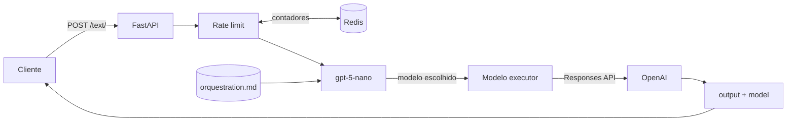
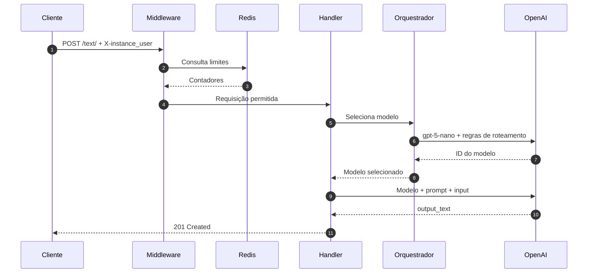

<h1 align="center">AiAgentSelector</h1>

<p align="center">
  Roteamento inteligente de modelos para aplicações que usam a OpenAI Responses API.
</p>

<p align="center">
  <a href="https://www.python.org/">
    
  </a>
  <a href="https://fastapi.tiangolo.com/">
    
  </a>
  <a href="https://developers.openai.com/api/">
    
  </a>
</p>

<p align="center">
  <a href="https://redis.io/">
    
  </a>
  <a href="https://www.docker.com/">
    
  </a>
  <a href="https://docs.pydantic.dev/">
    
  </a>
  <a href="LICENSE">
    
  </a>
</p>

<p align="center">
  <a href="#como-funciona">Como funciona</a> ·
  <a href="#arquitetura">Arquitetura</a> ·
  <a href="#como-executar">Como executar</a> ·
  <a href="#api">API</a> ·
  <a href="#contribuindo">Contribuindo</a>
</p>

---

## Sobre o projeto

Usar o modelo mais poderoso para toda solicitação funciona, mas nem sempre faz sentido. Tarefas simples acabam custando mais e levando mais tempo do que deveriam; tarefas difíceis, por outro lado, precisam de capacidade suficiente para não comprometer o resultado.

O **AiAgentSelector** fica entre o cliente e a API da OpenAI para resolver esse problema. Ele analisa cada entrada, escolhe um modelo compatível com a dificuldade da tarefa e só então executa a solicitação.

O projeto é **open source** e distribuído sob a [MIT License](LICENSE). Você pode usar, modificar e distribuir o código, desde que preserve o aviso de copyright e o texto da licença.

## Como funciona

Uma requisição completa passa por quatro etapas:

1. o middleware verifica o identificador enviado em `X-instance_user` e consulta os limites no Redis;
2. o `gpt-5-nano` recebe a entrada e escolhe um dos modelos permitidos;
3. o modelo escolhido recebe o prompt e a entrada do cliente;
4. a API devolve o texto gerado e informa qual modelo foi usado.

Isso significa que cada chamada bem-sucedida faz **duas inferências**: uma curta para roteamento e outra para execução.



## Seleção de modelos

As regras de decisão ficam em `src/repository/prompt/orquestration.md`. O objetivo não é escolher o maior modelo disponível, e sim o modelo mais econômico que ainda consiga resolver a tarefa com segurança.

| Modelo | Quando é escolhido |
|---|---|
| `gpt-5.6-luna` | Tarefas curtas, previsíveis e de baixa complexidade. |
| `gpt-5.6-terra` | Trabalho de complexidade moderada que pede equilíbrio entre custo e capacidade. |
| `gpt-5.6-sol` | Problemas ambíguos, profundos ou com várias restrições relacionadas. |
| `gpt-5.3-codex` | Implementação, alteração e depuração de código. |

O roteador deve responder somente com o ID exato de um desses modelos. Os modelos também precisam estar disponíveis para a conta e para o projeto associados à chave da API.

## Arquitetura

O AiAgentSelector é um monólito modular. A API roda em um único serviço FastAPI, com Redis e OpenAI como dependências externas.

| Camada | Arquivo ou diretório | Responsabilidade |
|---|---|---|
| Inicialização | `src/controller/init/main.py` | Cria a aplicação, registra CORS, middleware e rotas. |
| HTTP | `src/handles/text.py` | Recebe a chamada, coordena as inferências e monta a resposta. |
| Validação | `src/schema/text.py` | Define e valida o corpo aceito pelo endpoint. |
| Serviço | `src/service/agent.py` | Executa a etapa de escolha do modelo. |
| OpenAI | `src/utils/openai.py` | Centraliza as chamadas à Responses API. |
| Cache | `src/repository/redis/` | Lê e incrementa contadores temporários no Redis. |
| Prompt | `src/repository/prompt/` | Carrega as regras de roteamento. |
| Configuração | `src/config/settings.py` | Carrega e valida as variáveis de ambiente. |
| Logs | `src/logs/log.py` | Envia eventos para o terminal e para arquivo. |
| Infraestrutura | `src/controller/` | Contém Dockerfile, Compose e dependências fixadas. |

### Fluxo interno



### Estado da aplicação

A API não mantém sessão local. O estado compartilhado se resume aos contadores com expiração no Redis:

| Chave | Escopo |
|---|---|
| `global_rate_limit` | Todas as requisições. |
| `rate_limit:{user}` | Requisições associadas ao valor de `X-instance_user`. |

Os logs são gravados em `src/logs/app.log` e também enviados para a saída padrão do processo.

## Estrutura do projeto

```text
AiAgentSelector/
├── README.md
├── LICENSE
├── src/
│   ├── config/
│   │   └── settings.py
│   ├── controller/
│   │   ├── compose.yml
│   │   ├── depends/
│   │   │   ├── dockerfile
│   │   │   └── requirements.txt
│   │   └── init/
│   │       └── main.py
│   ├── handles/
│   │   └── text.py
│   ├── logs/
│   │   └── log.py
│   ├── midlleware/
│   │   └── base.py
│   ├── repository/
│   │   ├── module.py
│   │   ├── prompt/
│   │   │   ├── file.py
│   │   │   └── orquestration.md
│   │   └── redis/
│   │       ├── connect.py
│   │       └── control.py
│   ├── schema/
│   │   └── text.py
│   ├── service/
│   │   └── agent.py
│   └── utils/
│       └── openai.py
└── tests/
    ├── api.py
    ├── config.py
    ├── logs.py
    ├── repository.py
    ├── service.py
    └── utils.py
```

Os nomes `midlleware` e `orquestration.md` refletem a estrutura atual. Caso sejam corrigidos, os imports e caminhos correspondentes também precisam mudar.

## Tecnologias

| Tecnologia | Versão declarada | Papel no projeto |
|---|---:|---|
| Python | `3.14.7` | Runtime da aplicação. |
| FastAPI | `0.141.1` | API HTTP e geração do schema OpenAPI. |
| Uvicorn | `0.52.4` | Servidor ASGI. |
| Pydantic | `2.13.4` | Validação dos dados de entrada. |
| OpenAI SDK | `3.3.1` | Acesso à Responses API. |
| redis-py | `8.1.0` | Comunicação com o Redis. |
| Docker Compose | — | Execução conjunta da API e do Redis. |

## Como executar

### Requisitos

- Docker com o comando `docker compose`;
- uma chave da API da OpenAI;
- acesso aos modelos configurados no prompt de roteamento.

### Configuração

Crie `src/config/.env` com:

```dotenv
api_key=sk-substitua-pela-sua-chave
rate_limit=10
global_rate_limit=100
origin=http://localhost:3000
```

| Variável | Obrigatória | Uso |
|---|:---:|---|
| `api_key` | Sim | Autentica as chamadas à OpenAI. |
| `rate_limit` | Sim | Limite planejado por identificador de usuário. |
| `global_rate_limit` | Sim | Limite planejado para toda a aplicação. |
| `origin` | Não | Origem aceita pelo CORS; o padrão atual é `*`. |

Não envie o `.env` para o repositório. Se uma chave for exposta, revogue-a e gere outra.

### Docker Compose

Na raiz do projeto, execute:

```bash
docker compose -f src/controller/compose.yml up --build
```

A API estará disponível em `http://localhost:8000`.

Para encerrar:

```bash
docker compose -f src/controller/compose.yml down
```

O host do Redis está fixado como `redis`, nome resolvido pela rede do Compose. Para executar a API diretamente no sistema, esse endereço precisa ser parametrizado ou resolvido localmente.

## API

### `POST /text/`

Analisa a entrada, escolhe o modelo e devolve o resultado da execução.

#### Cabeçalho

```http
X-instance_user: identificador-do-cliente
```

Esse cabeçalho é obrigatório, mas não funciona como autenticação. O cliente pode escolher o próprio valor.

#### Corpo

| Campo | Tipo | Obrigatório | Descrição |
|---|---|:---:|---|
| `prompt` | `string` | Sim | Instruções enviadas ao modelo executor. |
| `input` | `string` | Sim | Conteúdo analisado e executado. |
| `temperature` | `float` | Sim | Temperatura desejada, quando aceita pelo modelo. |
| `max_token` | `integer \| float \| null` | Não | Repassado como `max_output_tokens`. |

#### Exemplo

```bash
curl http://localhost:8000/text/ \
  --request POST \
  --header 'Content-Type: application/json' \
  --header 'X-instance_user: exemplo-usuario' \
  --data '{
    "prompt": "Responda em português e use exemplos curtos.",
    "input": "Explique como funciona uma árvore binária de busca.",
    "temperature": 0.3,
    "max_token": 800
  }'
```

#### Resposta

```json
{
  "output": "Uma árvore binária de busca é...",
  "model": "gpt-5.6-terra",
  "type": "text"
}
```

O status de sucesso usado atualmente é `201 Created`.

| Status | Motivo |
|---:|---|
| `201` | Solicitação processada. |
| `422` | Cabeçalho ausente ou corpo inválido. |
| `429` | Limite global ou individual excedido. |
| `501` | Falha capturada durante o roteamento ou a geração. |

Use `/text/` com a barra final. A rota `/text` pode causar um redirecionamento e fazer a chamada passar novamente pelo middleware.

## Antes de usar em produção

O projeto está em fase de MVP. Estes pontos refletem o código atual e merecem atenção antes de uma implantação pública:

- `instance.set(name="global_rate_limit")` é chamado sem `await`, então o contador global não é incrementado como esperado;
- o contador individual é consultado, mas não é incrementado;
- os limites do ambiente e os valores do Redis são comparados como texto, não como números;
- as funções são `async`, porém os clientes OpenAI e Redis usados internamente são síncronos e podem bloquear o event loop;
- o pipeline Redis é global e compartilhado entre requisições;
- a resposta do roteador é usada como ID de modelo sem normalização ou validação em uma allowlist;
- `max_token` aceita números decimais, embora a API espere uma quantidade inteira de tokens;
- o middleware também intercepta documentação, health checks e requisições CORS de preflight;
- o Uvicorn inicia com `--reload`, opção adequada a desenvolvimento;
- Redis usa a tag `latest` e ainda não possui health check nem volume persistente.

Esses itens não mudam a proposta do projeto, mas ajudam a definir uma próxima etapa objetiva: tornar o rate limit atômico, usar clientes assíncronos, validar a saída do roteador e criar testes automatizados.

## Testes

O diretório `tests/` reúne scripts manuais para experimentar API, configuração, logs, Redis e OpenAI. Eles ainda não formam uma suíte automatizada: não usam `pytest`, não possuem asserções e alguns não acompanham as assinaturas assíncronas atuais.

Uma boa primeira contribuição é transformar esses scripts em testes unitários e de integração com mocks para OpenAI e Redis.

## Contribuindo

Contribuições são bem-vindas. Para manter as mudanças fáceis de revisar:

1. faça um fork do projeto;
2. crie uma branch para a alteração;
3. inclua testes quando mudar comportamento;
4. mantenha cada commit focado em uma única ideia;
5. abra um pull request explicando o problema e a solução.

Ao contribuir, você concorda que sua contribuição será distribuída sob a mesma MIT License do projeto.

## Créditos

Criado e mantido por **Brayan**.

Se você reutilizar ou distribuir este projeto, preserve o aviso de copyright e o arquivo `LICENSE`. Uma menção ao projeto original no seu README também é muito bem-vinda.

## Licença

Código aberto sob a [MIT License](LICENSE).

Copyright © 2026 Brayan.
