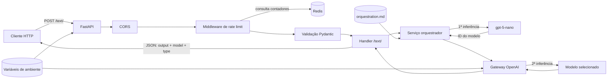
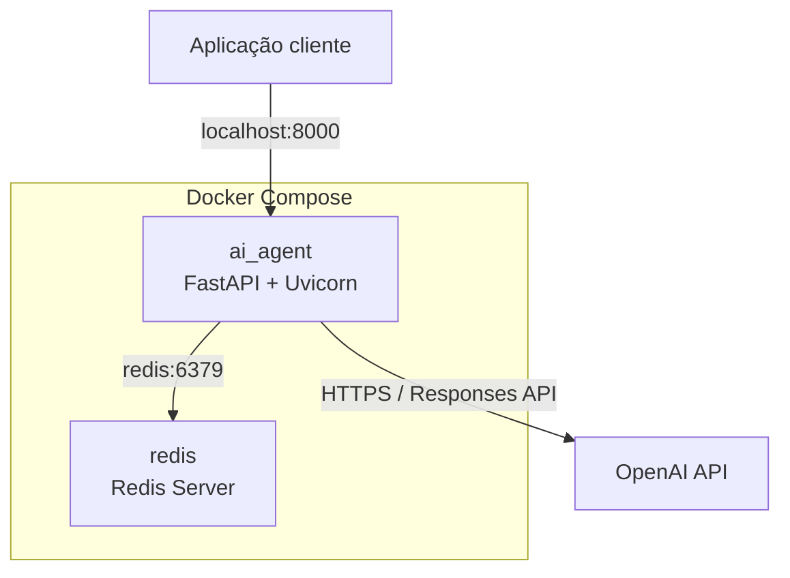
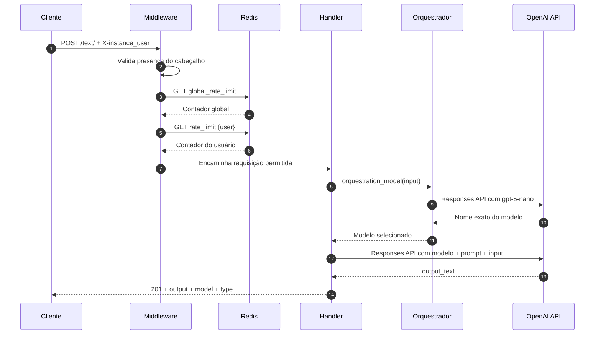

<p align="center">
  
</p>

<p align="center">
  <strong>Analisa a solicitação, seleciona o modelo de IA mais adequado e executa a tarefa com eficiência.</strong>
</p>

<p align="center">
  <a href="#sobre-o-projeto">Visão geral</a>&nbsp;&nbsp;•&nbsp;&nbsp;
  <a href="#arquitetura">Arquitetura</a>&nbsp;&nbsp;•&nbsp;&nbsp;
  <a href="#como-executar">Instalação</a>&nbsp;&nbsp;•&nbsp;&nbsp;
  <a href="#referência-da-api">API</a>&nbsp;&nbsp;•&nbsp;&nbsp;
  <a href="#roadmap-recomendado">Roadmap</a>
</p>

<p align="center">
  <a href="https://www.python.org/">
    
  </a>
  <a href="https://fastapi.tiangolo.com/">
    
  </a>
  <a href="https://developers.openai.com/api/">
    
  </a>
</p>

<p align="center">
  <a href="https://redis.io/">
    
  </a>
  <a href="https://www.docker.com/">
    
  </a>
  <a href="https://docs.pydantic.dev/">
    
  </a>
</p>

<p align="center">
  
  
  
</p>

---

## Sumário

- [Sobre o projeto](#sobre-o-projeto)
- [Principais recursos](#principais-recursos)
- [Arquitetura](#arquitetura)
- [Fluxo de uma requisição](#fluxo-de-uma-requisição)
- [Estratégia de seleção de modelos](#estratégia-de-seleção-de-modelos)
- [Estrutura do projeto](#estrutura-do-projeto)
- [Tecnologias](#tecnologias)
- [Como executar](#como-executar)
- [Referência da API](#referência-da-api)
- [Rate limiting](#rate-limiting)
- [Logs e observabilidade](#logs-e-observabilidade)
- [Testes](#testes)
- [Decisões arquiteturais](#decisões-arquiteturais)
- [Estado atual e pontos de atenção](#estado-atual-e-pontos-de-atenção)
- [Segurança](#segurança)
- [Roadmap recomendado](#roadmap-recomendado)
- [Licença](#licença)

## Sobre o projeto

O **AiAgentSelector** é uma API HTTP construída com FastAPI para realizar roteamento inteligente entre modelos de inteligência artificial.

Em vez de enviar todas as solicitações para um único modelo, o sistema utiliza um agente orquestrador para avaliar a tarefa recebida. Esse agente considera complexidade, profundidade de raciocínio, quantidade de restrições, natureza da tarefa e relação entre custo e capacidade. Depois da classificação, a API envia a mesma entrada ao modelo selecionado, usando as instruções fornecidas pelo consumidor da API.

Cada requisição bem-sucedida realiza, portanto, duas inferências:

1. **Seleção:** o `gpt-5-nano` analisa a entrada e retorna o identificador de um modelo permitido.
2. **Execução:** o modelo selecionado processa a entrada com o prompt, a temperatura e o limite de tokens informados pelo cliente.

O resultado contém tanto o texto produzido quanto o modelo utilizado, tornando o roteamento visível para o consumidor.

> [!NOTE]
> **Em uma frase:** o AiAgentSelector funciona como uma camada inteligente entre o cliente e a OpenAI, escolhendo capacidade suficiente para cada tarefa sem usar sempre o modelo mais caro.

## Principais recursos

<table>
  <tr>
    <td align="center" width="33%">
      <strong>🎯 Roteamento inteligente</strong><br />
      Seleciona o modelo com base na complexidade real da solicitação.
    </td>
    <td align="center" width="33%">
      <strong>💰 Eficiência de custo</strong><br />
      Prioriza o modelo mais econômico capaz de executar a tarefa.
    </td>
    <td align="center" width="33%">
      <strong>⚡ API assíncrona</strong><br />
      Expõe uma interface HTTP validada com FastAPI e Pydantic.
    </td>
  </tr>
  <tr>
    <td align="center" width="33%">
      <strong>🧠 OpenAI Responses API</strong><br />
      Centraliza seleção e geração por meio de um único gateway.
    </td>
    <td align="center" width="33%">
      <strong>🛡️ Controle de tráfego</strong><br />
      Projeta limites globais e individuais usando Redis.
    </td>
    <td align="center" width="33%">
      <strong>🐳 Pronto para contêiner</strong><br />
      Inicializa API e cache de forma integrada com Docker Compose.
    </td>
  </tr>
</table>

Além disso, o projeto oferece CORS configurável, logs no terminal e em arquivo e uma separação clara entre configuração, transporte HTTP, serviço, repositório e integrações externas.

## Arquitetura

### Visão geral

O projeto segue um **monólito modular em camadas**. A aplicação é implantada como um único serviço FastAPI, enquanto Redis e OpenAI são dependências externas.



### Componentes e responsabilidades

| Camada | Localização | Responsabilidade |
|---|---|---|
| Bootstrap | `src/controller/init/main.py` | Cria a instância FastAPI, registra CORS, middleware e rotas. |
| Controller/infraestrutura | `src/controller/` | Define a composição dos contêineres, imagem da aplicação e comando de inicialização. |
| Handler HTTP | `src/handles/text.py` | Implementa `POST /text/`, coordena seleção e execução e monta a resposta JSON. |
| Middleware | `src/midlleware/base.py` | Exige o cabeçalho de usuário e consulta os limites global e individual. |
| Schema | `src/schema/text.py` | Valida o corpo da requisição com Pydantic. |
| Serviço | `src/service/agent.py` | Executa o agente orquestrador com o prompt de roteamento. |
| Gateway de IA | `src/utils/openai.py` | Encapsula a criação de respostas pelo SDK da OpenAI. |
| Repositório Redis | `src/repository/redis/` | Mantém a conexão e as operações dos contadores temporários. |
| Repositório de prompt | `src/repository/prompt/` | Carrega e valida o prompt de orquestração em tempo de importação. |
| Configuração | `src/config/settings.py` | Carrega e valida as variáveis de ambiente obrigatórias. |
| Observabilidade | `src/logs/log.py` | Configura logs para `stdout` e `src/logs/app.log`. |

### Dependências externas



O serviço `ai_agent` é exposto na porta `8000`. O Redis permanece acessível apenas pela rede interna do Compose, pois não possui porta publicada para o host.

## Fluxo de uma requisição



Detalhamento do processamento:

1. O cliente envia um `POST` para `/text/` com o cabeçalho `X-instance_user`.
2. O middleware rejeita a chamada se o cabeçalho não estiver presente.
3. Os contadores global e individual são consultados no Redis.
4. O Pydantic valida `prompt`, `input`, `temperature` e, quando presente, `max_token`.
5. O prompt estático de `orquestration.md` é enviado ao `gpt-5-nano` junto da entrada.
6. O orquestrador deve responder somente com um dos identificadores autorizados.
7. O handler chama novamente a Responses API, desta vez com o modelo selecionado.
8. Para modelos listados como incompatíveis, o gateway omite o parâmetro `temperature`.
9. A propriedade `output_text` do SDK é devolvida ao cliente junto do modelo escolhido.

> **Impacto operacional:** a latência e o custo de uma chamada incluem duas inferências de modelo, além das consultas ao Redis.

## Estratégia de seleção de modelos

O arquivo `src/repository/prompt/orquestration.md` contém as regras de roteamento. Ele instrui o agente a escolher o modelo mais econômico que ainda tenha capacidade suficiente para concluir a tarefa com boa probabilidade de sucesso.

| Modelo permitido | Papel definido no prompt | Exemplos de uso esperado |
|---|---|---|
| `gpt-5.6-luna` | Nível econômico e padrão | Solicitações simples, curtas, previsíveis e de baixa complexidade. |
| `gpt-5.6-terra` | Equilíbrio entre custo e capacidade | Tarefas moderadas, análises comuns e trabalhos com múltiplas etapas. |
| `gpt-5.6-sol` | Maior capacidade geral | Problemas ambíguos, profundos, sensíveis ou com muitas restrições simultâneas. |
| `gpt-5.3-codex` | Especialização em engenharia de software | Implementação, alteração, depuração e trabalho prático sobre código. |

O roteador em si utiliza `gpt-5-nano`. A resposta do roteador é usada diretamente como o parâmetro `model` da segunda chamada.

### Critérios centrais do prompt

- profundidade de raciocínio exigida;
- dificuldade de interpretar a intenção;
- número e interação das restrições;
- risco e necessidade de precisão;
- natureza conceitual ou prática da tarefa;
- foco específico em engenharia de software;
- custo relativo entre modelos capazes de resolver o problema;
- resistência a tentativas do próprio input de forçar uma escolha.

Os IDs precisam estar habilitados para a conta e o projeto da API utilizados na implantação.

## Estrutura do projeto

```text
AiAgentSelector/
├── README.md
├── src/
│   ├── .gitignore
│   ├── config/
│   │   └── settings.py
│   ├── controller/
│   │   ├── compose.yml
│   │   ├── depends/
│   │   │   ├── .dockerignore
│   │   │   ├── dockerfile
│   │   │   └── requirements.txt
│   │   └── init/
│   │       └── main.py
│   ├── handles/
│   │   └── text.py
│   ├── logs/
│   │   └── log.py
│   ├── midlleware/
│   │   └── base.py
│   ├── repository/
│   │   ├── module.py
│   │   ├── prompt/
│   │   │   ├── file.py
│   │   │   └── orquestration.md
│   │   └── redis/
│   │       ├── connect.py
│   │       └── control.py
│   ├── schema/
│   │   └── text.py
│   ├── service/
│   │   └── agent.py
│   └── utils/
│       └── openai.py
└── tests/
    ├── api.py
    ├── config.py
    ├── logs.py
    ├── repository.py
    ├── service.py
    └── utils.py
```

> O diretório `midlleware` e o arquivo `orquestration.md` mantêm a grafia usada atualmente no código. Renomeá-los exige atualizar os respectivos imports e caminhos.

## Tecnologias

| Tecnologia | Versão declarada | Uso |
|---|---:|---|
| Python | `3.14.7` na imagem | Linguagem e runtime. |
| FastAPI | `0.141.1` | API HTTP, roteamento e OpenAPI. |
| Uvicorn | `0.52.4` | Servidor ASGI. |
| Pydantic | `2.13.4` | Validação do corpo das requisições. |
| OpenAI SDK | `3.3.1` | Cliente da Responses API. |
| Redis client | `8.1.0` | Pipeline e acesso aos contadores. |
| python-dotenv | `1.2.3` | Carregamento de configuração local. |
| Docker Compose | — | Orquestração da API e do Redis. |

Todas as dependências Python estão fixadas em `src/controller/depends/requirements.txt`.

## Como executar

### Pré-requisitos

- Docker com suporte ao comando `docker compose`;
- uma chave válida da API da OpenAI;
- acesso, na conta utilizada, aos modelos definidos no prompt de orquestração.

### 1. Configure o ambiente

Crie `src/config/.env`:

```dotenv
api_key=sk-substitua-pela-sua-chave
rate_limit=10
global_rate_limit=100
origin=http://localhost:3000
```

| Variável | Obrigatória | Descrição | Exemplo |
|---|:---:|---|---|
| `api_key` | Sim | Chave usada pelo SDK da OpenAI. | `sk-...` |
| `rate_limit` | Sim | Limite planejado por usuário na janela do Redis. | `10` |
| `global_rate_limit` | Sim | Limite planejado para todas as requisições. | `100` |
| `origin` | Não | Origem aceita pelo CORS. Usa `*` quando ausente. | `http://localhost:3000` |

Nunca versiona o arquivo `.env`. O `.gitignore` do projeto já declara `config/.env` quando o contexto do repositório está em `src`.

### 2. Inicie os serviços

Execute a partir da raiz do projeto:

```bash
docker compose -f src/controller/compose.yml up --build
```

A API ficará disponível em:

```text
http://localhost:8000
```

Para encerrar e remover os contêineres:

```bash
docker compose -f src/controller/compose.yml down
```

### Execução sem Docker

O caminho suportado pela configuração atual é o Docker Compose. O conector Redis usa o hostname fixo `redis`, resolvido pela rede interna do Compose. Para executar a API diretamente no host, é necessário tornar esse hostname resolvível ou parametrizar o host do Redis no código.

## Referência da API

### Processar texto

```http
POST /text/
Content-Type: application/json
X-instance_user: <identificador-do-cliente>
```

Use a barra final em `/text/`. Uma chamada para `/text` pode gerar redirecionamento automático, fazendo a requisição atravessar o middleware mais de uma vez.

### Cabeçalho obrigatório

| Cabeçalho | Tipo | Descrição |
|---|---|---|
| `X-instance_user` | `string` | Identifica o consumidor usado pelo rate limit individual. Atualmente não representa autenticação. |

### Corpo da requisição

| Campo | Tipo | Obrigatório | Descrição |
|---|---|:---:|---|
| `prompt` | `string` | Sim | Instruções usadas pela segunda inferência. |
| `input` | `string` | Sim | Solicitação analisada pelo orquestrador e executada pelo modelo selecionado. |
| `temperature` | `float` | Sim | Temperatura desejada. O gateway a omite para modelos marcados como incompatíveis. |
| `max_token` | `integer \| float \| null` | Não | Mapeado internamente para `max_output_tokens`; quando ausente, usa o padrão da API. |

### Exemplo com cURL

```bash
curl --request POST \
  --url http://localhost:8000/text/ \
  --header 'Content-Type: application/json' \
  --header 'X-instance_user: exemplo-usuario' \
  --data '{
    "prompt": "Responda em português, com clareza e exemplos.",
    "input": "Explique como funciona uma árvore binária de busca.",
    "temperature": 0.3,
    "max_token": 800
  }'
```

### Resposta de sucesso

Status atual: `201 Created`.

```json
{
  "output": "Uma árvore binária de busca é...",
  "model": "gpt-5.6-terra",
  "type": "text"
}
```

| Campo | Descrição |
|---|---|
| `output` | Texto consolidado retornado pela Responses API. |
| `model` | Identificador selecionado pelo orquestrador. |
| `type` | Tipo do conteúdo; atualmente sempre `text`. |

### Respostas de erro observáveis

| Status | Situação |
|---:|---|
| `422` | Cabeçalho `X-instance_user` ausente ou corpo incompatível com o schema. |
| `429` | Limite global ou individual excedido, quando os contadores estiverem ativos. |
| `501` | Exceção capturada pelo handler durante seleção ou geração. |

O FastAPI também gera a especificação OpenAPI e as interfaces `/docs` e `/redoc`; no estado atual, o middleware global exige `X-instance_user` inclusive nessas rotas, o que limita o acesso direto pelo navegador.

## Rate limiting

O desenho utiliza contadores Redis com expiração padrão de 60 segundos.

| Chave Redis | Escopo | Finalidade |
|---|---|---|
| `global_rate_limit` | Aplicação | Contabilizar chamadas de todos os consumidores. |
| `rate_limit:{user}` | Usuário | Contabilizar chamadas do valor recebido em `X-instance_user`. |

`ControlCache.set()` agenda um `INCR`, aplica `EXPIRE` e executa o pipeline. `ControlCache.get()` agenda um `GET` e devolve o primeiro resultado do pipeline.

O cabeçalho funciona apenas como identificador lógico. Como seu valor é controlado pelo cliente, ele não deve ser tratado como identidade autenticada sem uma camada adicional de autenticação.

## Logs e observabilidade

O logger global usa o formato:

```text
timestamp | level | logger | message
```

Os eventos são enviados para:

- saída padrão do processo, visível em `docker compose logs`;
- `src/logs/app.log`, dentro do contêiner.

Atualmente são registrados inicialização do Redis, acesso às rotas, consultas de limite, modelo usado, alertas de compatibilidade e exceções. O conteúdo do prompt e da resposta não é registrado pelo gateway.

Como não há volume nem rotação configurados para `app.log`, o arquivo é efêmero quando o contêiner é removido e pode crescer durante uma execução longa.

## Testes

O diretório `tests/` contém scripts manuais para experimentar partes isoladas do sistema:

- `api.py`: chamada HTTP ao endpoint;
- `config.py`: leitura dos limites configurados;
- `logs.py`: escrita de uma mensagem de log;
- `repository.py`: carregamento do prompt e tentativa de acesso ao cache;
- `service.py`: tentativa de seleção de modelo;
- `utils.py`: chamada direta ao gateway OpenAI.

Esses arquivos ainda não constituem uma suíte automatizada: não usam `pytest`, não possuem asserções e alguns exemplos não foram atualizados para as assinaturas assíncronas atuais. Eles devem ser tratados como scripts exploratórios até serem revisados.

## Decisões arquiteturais

### Roteamento por LLM

Uma LLM é usada para classificar solicitações abertas, evitando manter uma árvore rígida de regras no código. A contrapartida é adicionar custo, latência e uma segunda possibilidade de falha a toda chamada.

### Prompt versionado em Markdown

As regras ficam fora do código em `orquestration.md`, facilitando leitura e evolução. O arquivo é carregado uma vez durante a importação e a aplicação falha ao iniciar se ele estiver ausente ou vazio.

### Gateway único para a OpenAI

`request_llm()` centraliza a criação do cliente, o uso da Responses API, o limite de saída e a compatibilidade de temperatura. Isso reduz duplicação entre o roteador e o executor.

### Redis como estado temporário

O serviço HTTP permanece conceitualmente sem estado de sessão. Os contadores compartilhados ficam no Redis e podem atender múltiplas réplicas da API, desde que as operações sejam feitas de forma atômica e segura para concorrência.

### Identificador de modelo visível

Retornar `model` na resposta facilita auditoria, análise de custo e avaliação futura da qualidade do roteamento.

## Estado atual e pontos de atenção

Esta seção descreve o comportamento do código recebido, não requisitos adicionais para uma primeira leitura do projeto.

| Prioridade | Ponto observado | Impacto |
|:---:|---|---|
| Alta | A chamada `instance.set(name="global_rate_limit")` no middleware não usa `await`. | O contador global não é incrementado pela execução atual e pode gerar aviso de coroutine não aguardada. |
| Alta | O contador `rate_limit:{user}` é consultado, mas nunca incrementado. | O limite individual não entra em vigor a partir de um Redis vazio. |
| Alta | Cliente OpenAI e cliente Redis são síncronos dentro de funções `async`. | As operações de rede podem bloquear o event loop e reduzir concorrência. |
| Alta | Um único objeto Redis `Pipeline` é compartilhado globalmente. | Requisições concorrentes podem misturar comandos; pipelines também não tornam o ciclo `GET`/comparação/`INCR` atômico. |
| Média | Limites do ambiente e valores Redis permanecem como texto. | Comparações são lexicográficas, não numéricas; por exemplo, `"9" >= "10"` produz um resultado incorreto para rate limit. |
| Média | O modelo retornado pelo orquestrador não é normalizado nem validado no código. | Espaços, formatação inesperada ou um ID fora da allowlist podem fazer a segunda chamada falhar. |
| Média | `max_token` aceita `float`, mas `max_output_tokens` representa uma quantidade inteira. | Valores decimais podem ser rejeitados pela API externa. |
| Média | O corpo de erro usa um objeto `Exception` diretamente em `JSONResponse`. | A serialização do próprio erro pode falhar; o status `501` também não representa todos os tipos de falha envolvidos. |
| Média | O middleware cobre todas as rotas e exige o cabeçalho antes do encaminhamento. | OpenAPI, documentação, health checks e requisições CORS `OPTIONS` podem ser bloqueados. |
| Média | O contêiner inicia Uvicorn com `--reload`. | Adequado ao desenvolvimento, mas não recomendado para produção. |
| Baixa | Redis usa `latest`, sem versão fixa, health check ou volume. | Builds podem mudar com o tempo; `depends_on` garante ordem, não prontidão; dados são descartáveis. |
| Baixa | Os scripts em `tests/` estão defasados em relação às funções assíncronas. | Não existe hoje uma verificação automatizada confiável contra regressões. |

## Segurança

- mantenha `api_key` exclusivamente no ambiente ou em um gerenciador de segredos;
- nunca adicione `src/config/.env` ao repositório ou à imagem;
- restrinja `origin` aos domínios conhecidos em ambientes públicos;
- não use `X-instance_user` como autenticação: o cliente pode escolher qualquer valor;
- adicione autenticação e autorização antes de expor o endpoint publicamente;
- limite tamanho de `prompt` e `input` para controlar custo e abuso;
- valide o modelo retornado contra uma allowlist antes da segunda chamada;
- não devolva detalhes internos de exceções ao consumidor;
- aplique limites também no provedor, no proxy ou no gateway de entrada;
- avalie proteção contra prompt injection, pois a entrada do cliente participa da decisão de roteamento.

## Roadmap recomendado

- [ ] converter `rate_limit` e `global_rate_limit` para inteiros durante a inicialização;
- [ ] corrigir e tornar atômica a contabilização global e individual no Redis;
- [ ] trocar clientes síncronos por `AsyncOpenAI` e Redis assíncrono, ou executar I/O bloqueante fora do event loop;
- [ ] usar um cliente Redis compartilhado e criar pipelines locais por operação;
- [ ] validar e normalizar a saída do orquestrador contra uma allowlist;
- [ ] separar rotas públicas, documentação, health check e preflight do middleware de uso;
- [ ] padronizar erros em um schema serializável e usar códigos HTTP semânticos;
- [ ] alterar `max_token` para inteiro e adicionar limites aos campos do payload;
- [ ] criar testes unitários, de integração e de contrato com mocks da OpenAI e Redis;
- [ ] fixar a versão da imagem Redis e adicionar health checks;
- [ ] remover `--reload` e definir política de workers para produção;
- [ ] adicionar rotação ou exportação estruturada de logs;
- [ ] incluir métricas de latência, modelo escolhido, tokens e taxa de erro;
- [ ] adicionar CI, lint, formatação, análise de tipos e cobertura;
- [ ] parametrizar host e porta do Redis;
- [ ] corrigir gradualmente a nomenclatura `midlleware`/`orquestration` sem quebrar imports.

## Referências

- [FastAPI](https://fastapi.tiangolo.com/)
- [Redis](https://redis.io/docs/latest/)
- [Docker Compose](https://docs.docker.com/compose/)
- [OpenAI — criação de respostas](https://developers.openai.com/api/reference/cli/resources/responses/methods/create)

## Licença

O pacote analisado não inclui um arquivo de licença. Antes de distribuir ou aceitar contribuições externas, escolha uma licença e adicione um arquivo `LICENSE` na raiz do projeto.

---

<div align="center">

Desenvolvido para tornar a escolha de modelos de IA mais eficiente, transparente e orientada à complexidade real de cada tarefa.

</div>
